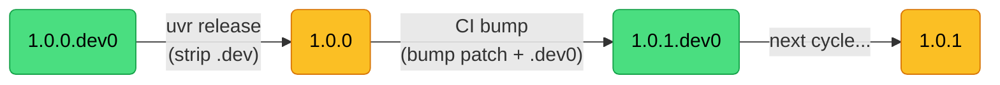
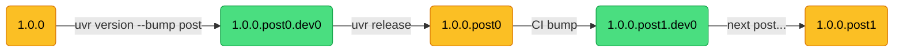
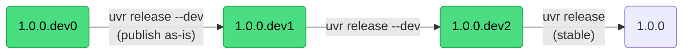
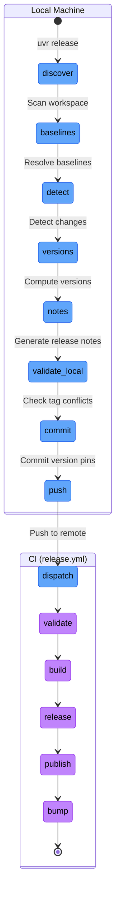
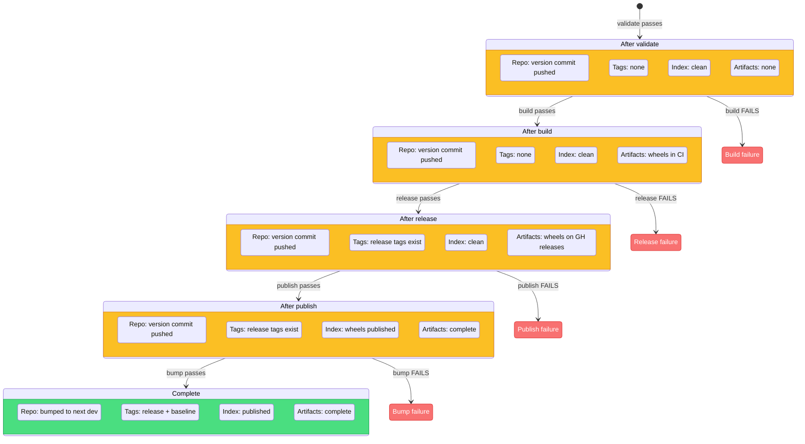

# Release Pipeline

One command detects changes, builds on the right runners, creates GitHub releases, publishes to PyPI, bumps versions, and pushes. All planned locally, executed on CI.

## The plan

The plan encodes everything CI needs.

| Field | Purpose |
|-------|---------|
| `build_matrix` | Unique runner sets (drives CI `strategy.matrix`) |
| `python_version` | Python version for CI (default "3.12") |
| `publish_environment` | GitHub Actions environment for trusted publishing |
| `skip` | Job names to skip |
| `reuse_run` | Workflow run ID to reuse artifacts from |
| `reuse_releases` | Whether to reuse existing GitHub releases |
| `jobs` | Ordered list of Job objects with commands |
| `changes` | Detected package changes |

The plan is serialized as JSON and passed via `gh workflow run release.yml -f plan=<json>`.

## Version state space

A package's version in `pyproject.toml` follows PEP 440. `uvr` recognizes 11 distinct version forms via the `VersionState` enum. Each form determines which release types are valid, how baselines are resolved, and what the post-release bump looks like.

| VersionState | Example | Description |
|---|---|---|
| `CLEAN_STABLE` | `1.2.3` | Released stable version (transient) |
| `DEV0_STABLE` | `1.2.3.dev0` | Start of development toward `1.2.3` |
| `DEVK_STABLE` | `1.2.3.dev3` | After dev releases toward `1.2.3` |
| `CLEAN_PRE0` | `1.2.3a0` | First pre-release of a kind (transient) |
| `CLEAN_PREN` | `1.2.3a2` | Subsequent pre-release (transient) |
| `DEV0_PRE` | `1.2.3a1.dev0` | Start of development toward `1.2.3a1` |
| `DEVK_PRE` | `1.2.3a1.dev3` | After dev releases toward `1.2.3a1` |
| `CLEAN_POST0` | `1.2.3.post0` | First post-release (transient) |
| `CLEAN_POSTM` | `1.2.3.post2` | Subsequent post-release (transient) |
| `DEV0_POST` | `1.2.3.post0.dev0` | Start of development toward `1.2.3.post0` |
| `DEVK_POST` | `1.2.3.post0.dev3` | After dev releases toward `1.2.3.post0` |

"Transient" forms exist briefly during the release pipeline between the "set release versions" commit and the "prepare next release" bump commit. The "dev" forms are the at-rest states that developers see during normal work.

The distinction between `DEV0` and `DEVK` matters for baseline resolution. `DEV0` means no dev releases have been published yet in this cycle. `DEVK` (where K > 0) means at least one dev release was published, which shifts the dev number forward.

### Stable release cycle

The most common path. Development happens at `.dev0`, release strips the suffix, and the bump phase advances to the next patch.

### Pre-release cycle

Enter a pre-release track by setting an explicit version with `uvr version --set 1.0.0a0.dev0`, iterate with `uvr release` (auto-detected as pre-release from the version string), advance to the next kind with another `--set`, and exit to stable with `uvr version --bump stable` followed by `uvr release`.

```mermaid
flowchart LR
    classDef rest fill:#4ade80,stroke:#16a34a,color:#000
    classDef transient fill:#fbbf24,stroke:#d97706,color:#000

    dev0("1.0.0.dev0"):::rest
    adev("1.0.0a0.dev0"):::rest
    a0("1.0.0a0"):::transient
    a1dev("1.0.0a1.dev0"):::rest
    bdev("1.0.0b0.dev0"):::rest
    b0("1.0.0b0"):::transient
    b1dev("1.0.0b1.dev0"):::rest
    rcdev("1.0.0rc0.dev0"):::rest
    stable("1.0.0"):::transient
    next("1.0.1.dev0"):::rest

    dev0 -->|"uvr version --set 1.0.0a0.dev0"| adev
    adev -->|"uvr release"| a0
    a0 -->|"CI bump"| a1dev
    a1dev -->|"uvr version --set 1.0.0b0.dev0"| bdev
    bdev -->|"uvr release"| b0
    b0 -->|"CI bump"| b1dev
    b1dev -->|"uvr version --set 1.0.0rc0.dev0"| rcdev
    rcdev -->|"uvr release<br/>(stable)"| stable
    stable -->|"CI bump"| next
```

### Post-release cycle

Post-releases fix a published stable version without bumping the version number. Enter with `uvr version --bump post` from a clean final version.

Post-release versions cannot enter pre-release and vice versa. These are separate tracks from a given stable version.

### Dev release cycle

Dev releases publish the `.devN` version as-is rather than stripping it. The bump phase increments the dev number instead of the patch.

Dev releases can happen from any `.dev` version. A stable release from `.devN` strips the suffix and publishes the underlying version.

### Release version transformation

How the current version maps to `release_version` and `next_version` for each release type.

| Current Version | Release Type | Release Version | Next Version |
|---|---|---|---|
| `1.0.0.dev0` | stable | `1.0.0` | `1.0.1.dev0` |
| `1.0.0.dev3` | stable | `1.0.0` | `1.0.1.dev0` |
| `1.0.0.dev0` | dev | `1.0.0.dev0` | `1.0.0.dev1` |
| `1.0.0.dev3` | dev | `1.0.0.dev3` | `1.0.0.dev4` |
| `1.0.0a0.dev0` | pre | `1.0.0a0` | `1.0.0a1.dev0` |
| `1.0.0a2.dev0` | stable | `1.0.0` | `1.0.1.dev0` |
| `1.0.0.post0.dev0` | post | `1.0.0.post0` | `1.0.0.post1.dev0` |

## Local phase

| Step | What happens |
|---|---|
| Scan workspace | Read `[tool.uv.workspace].members`, apply include/exclude |
| Resolve baselines | Call `_find_baseline_tag()` per package |
| Detect changes | Tree OID comparison + transitive BFS propagation |
| Compute versions | Current version to release version to next version |
| Generate release notes | Commit log between baseline and HEAD for each changed package |
| Check tag conflicts | Verify no planned tags already exist in the repo |
| Commit version pins | Write release versions + dep pins, commit |
| Push + dispatch | `git push`, then `gh workflow run release.yml -f plan=<json>` |

If `--dry-run` is passed, everything through "Generate release notes" runs but no commits, pushes, or dispatches happen.

## CI phase

### validate

Always runs. Cannot be skipped. Confirms the plan schema version matches the deployed `uvr`.

### build

One CI job per unique runner. Each job runs topologically layered builds and uploads wheels as `wheels-<runner-labels>`. See [Build System](build.md) for details on layer assignment and build ordering.

### release

Downloads all `wheels-*` artifacts and creates one GitHub release per changed package. Each release gets a tag (`{name}/v{version}`), release notes, and attached wheels. The `[tool.uvr.config].latest` setting controls the "Latest" badge.

### publish

Optional. Runs `uv publish` per changed package. The `environment` field enables trusted publishing via OIDC between your GitHub repo and PyPI. No API tokens needed.

### bump

The only CI job that writes to the repository.

1. Bump to next dev version
2. Pin internal deps to just-published versions
3. Sync lockfile, commit, tag baselines, push

## Failure modes

When a CI job fails, the pipeline stops and leaves the system in a partial state.

### Recovery commands

| Failure Point | System State | Recovery Command |
|---|---|---|
| build fails | Version commit pushed. No tags. No wheels. | Re-run the workflow or revert and start over. |
| release fails | Wheels exist in CI artifacts. No tags. | `uvr release --skip build --reuse-run <RUN_ID>` |
| publish fails | Release tags and GitHub releases exist. | `uvr release --skip build --skip release` |
| bump fails | Everything published. Repo not bumped. | `uvr release --skip build --skip release --skip publish` |

The `--reuse-run` flag tells the build phase to download wheels from the specified CI run's artifacts instead of building from scratch.

When `release` is skipped, release tag conflict checks are suppressed because the tags already exist from the previous run.

## Tag conflict detection

Before generating a plan, the planner checks whether any planned tags already exist in the local repo.

Release tags (`{name}/v{release_version}`) are checked unless `release` is in the skip list. Skipping release means the tags already exist from a previous successful run.

Baseline tags (`{name}/v{next_version}-base`) are always checked.

If conflicts are found, the planner exits with suggestions.

1. Use `--bump post` to publish a post-release instead
2. Bump past the conflict with `uvr version`

## Version conflict detection

Separately from tag conflicts, the planner checks whether any package's dev version targets a version that was already released. For example, if `pyproject.toml` says `1.0.1a1.dev0` but the tag `pkg/v1.0.1a1` already exists, that version was already published and should not be developed toward again.

The resolution is to bump past the conflict with `uvr version`.
